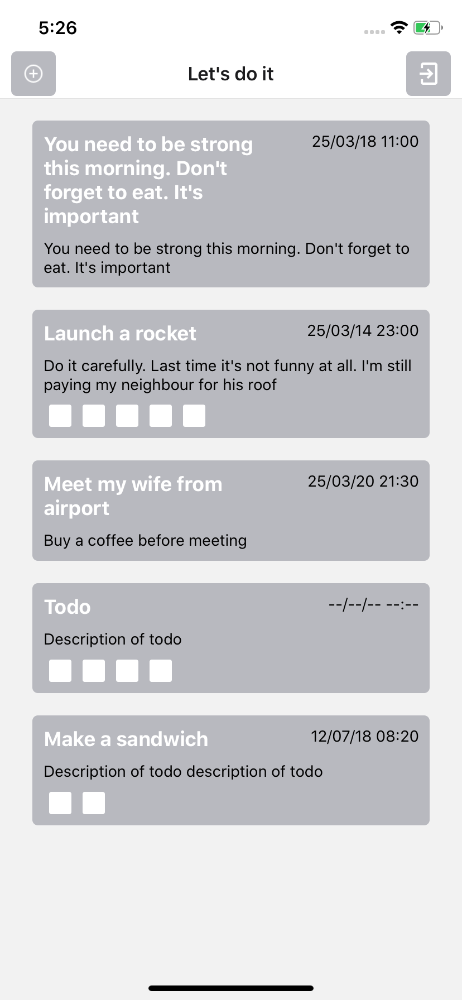
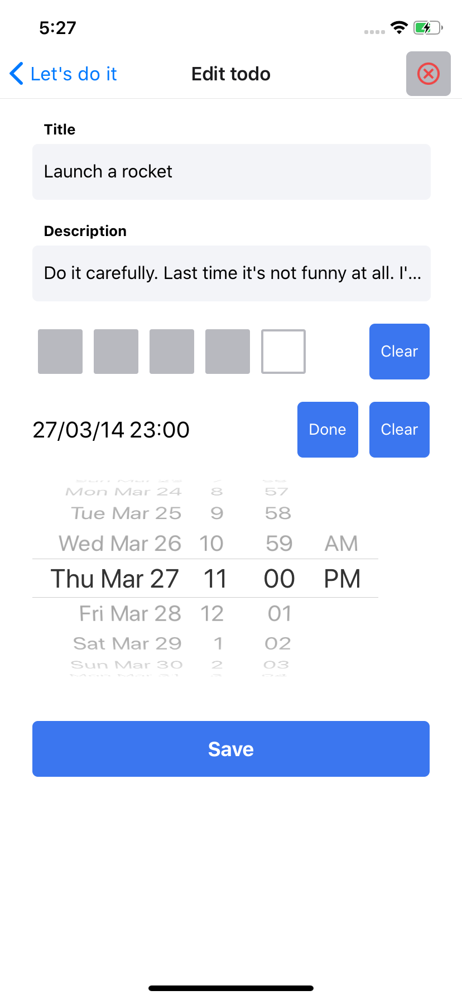
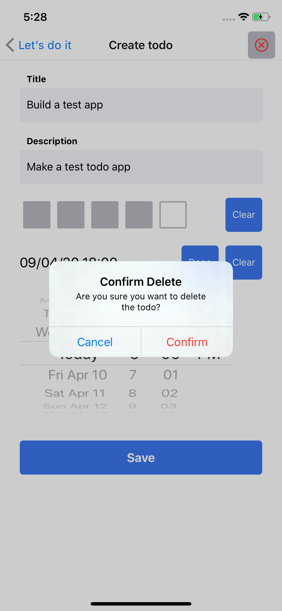

## SuperTODO app

Create a todo and be productive

## How to build and run the app:

### iOS:
Cocoapods should be installed
```
$ npm run refresh (In case there is some problems with finding pods - try pod repo update)
$ npm run ios (or Run with Xcode)
```

### Android:
```
$ npm run refresh
$ npm run android
```


## Screenshots

---
  

